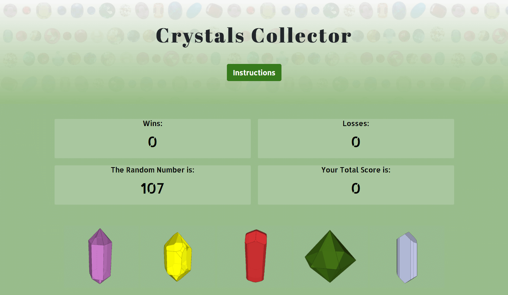

# Crystals Collector

__Game Instructions:__
* The player is given a random number at the start of the game.
* There are five crystals at the bottom of the page. Each crystal has a hidden points value between 1 and 10.
* By clicking on a crystal, the player will add will add that crystal's amount of points to the total score.
* The goal is for the player to match the total score to the random number provided at the beginning of the game.
* If the total score matches the random number, the player wins.
* If the total score goes above the random number, the player loses.
* Each time a new game starts, the game automatically generates a new random number and the points value of each crystal changes.

#### > __Click Below to Try it Out:__

